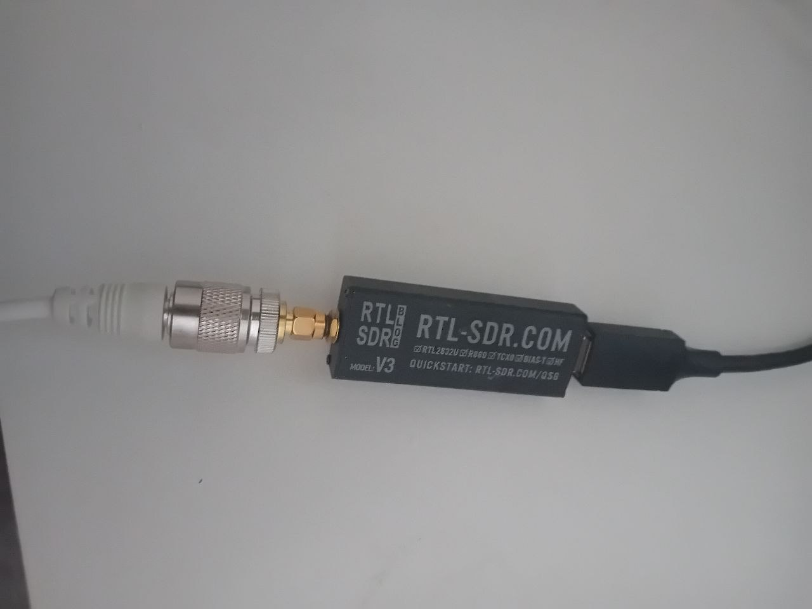
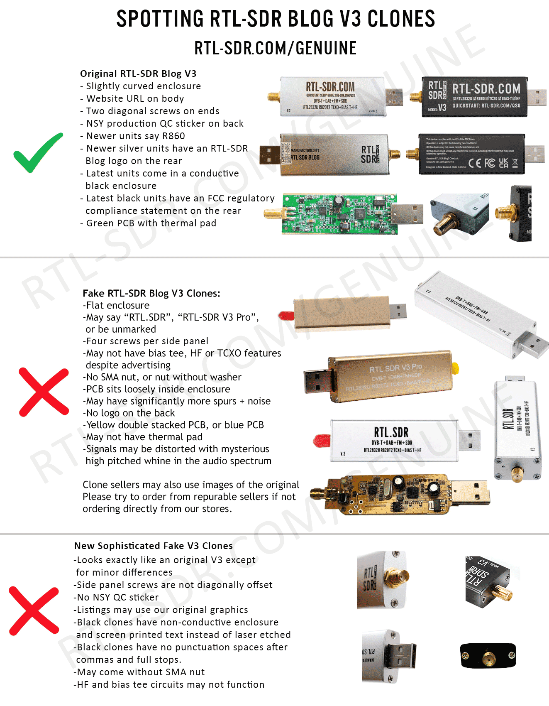

# Hardware Bill of Materials

Everything I used to build the AIS receiver for [portcongest.com](https://portcongest.com). Sourced from Shopee and Lazada Philippines, with prices in PHP and approximate USD (at ~₱57/$1).

---

## Parts List

| # | Part | Seller | Where | PHP | USD (approx) |
|---|------|--------|-------|-----|-------------|
| 1 | Raspberry Pi 4 Model B (2GB) | PC cold store | Shopee PH | ₱4,640 | ~$81 |
| 2 | RTL-SDR Blog V3 R860 (RTL2832U, 1PPM TCXO, SMA) | GlobalLifestyle | Shopee PH | ₱3,502 | ~$61 |
| 3 | Retevis MA06 VHF Marine Antenna 3.5dBi 43.3" fiberglass | Retevis Direct Store | Shopee PH | ₱3,147 | ~$55 |
| 4 | Official Raspberry Pi 4 Power Supply (5V/3A USB-C, EU) | Official | Lazada PH | ₱857 | ~$15 |
| 5 | Raspberry Pi 4 Case (black ABS) | Makerlab | Shopee PH | ₱219 | ~$4 |
| 6 | USB 3.0 Extension Cable 0.5M | Jasoz | Shopee PH | ₱99 | ~$2 |
| 7 | CAT5E LAN Cable 5M | Yasmos | Shopee PH | ₱35 | ~$1 |
| 8 | Duct tape 50mm×10m (antenna mount) | CASTA | Shopee PH | ₱42 | ~$1 |
| 9 | 32GB microSD card | — | Bought in Norway | — | ~$9 |
| | **Total** | | | **~₱12,541** | **~$229** |

> Prices are from early 2026 and will vary. Search Shopee/Lazada for "RTL-SDR Blog V3" and "VHF marine antenna". Make sure to check seller authenticity before buying (see RTL-SDR section below).

---

## The antenna


The **Retevis MA06** is a 43.3" (1.1m) fiberglass VHF marine antenna rated at 3.5 dBi, tuned for **161.975 MHz and 162.025 MHz**, the two AIS channels. I mounted mine on the AC unit on the balcony with duct tape. Glamorous? No. Effective? Yes. The balcony is at **143m above sea level** with a direct line-of-sight to Manila Bay, and that elevation does all the heavy lifting.

Key things to get right:
- **Frequency matters.** A generic VHF whip antenna might work but an AIS-tuned antenna will dramatically improve range. AIS uses **161.975 MHz and 162.025 MHz** (VHF channels 87B and 88B) and the antenna should be tuned for these.
- **Elevation matters most.** AIS is VHF and strictly line-of-sight. The radio horizon formula is `d = 4.12 x sqrt(h)` (km, metres). At my site (**143m ASL**), the antenna-side horizon alone is ~49 km. Add a vessel at 5-10m mast height and the combined range reaches 55-60 km geometrically, and up to ~74 km with normal atmospheric refraction over water. At ground level (1-2m), you'd be lucky to see 15-20 km.
- **Check the connector.** The Retevis MA06 terminates in PL-259 (UHF male). The RTL-SDR V3 has an SMA male port. You need a PL-259 female to SMA female adapter between them.

---

## The RTL-SDR dongle

The RTL2832U chipset (USB ID `0bda:2838`) is the heart of the whole system. The **RTL-SDR V3** variant includes:
- A TCXO for better frequency stability
- Direct sampling mode for HF
- Bias-T power output (useful for powered antennas)

For AIS specifically, any RTL2832U dongle works. The V3 just has better build quality and temperature stability.

---

## Parts I bought by mistake

This section exists so you don't repeat my mistakes.



### The connector rabbit hole

The Retevis MA06 antenna ends in a **PL-259 (UHF male)** connector. The RTL-SDR V3 has an **SMA male** port. They don't connect directly. You need an adapter chain.

Here's what I actually bought trying to figure this out:

| Part | Price | Outcome |
|------|-------|---------|
| PL259 UHF male to SMA male (SZ Consumer Electronics) | ₱113 (~$2) | Wrong: plug-to-plug, nothing to connect to |
| SMA female to UHF female SO-239 (Electr stores) | ₱127 (~$2) | Wrong direction |
| F female to SMA female (YIBAR MAOHONG) | ₱50.73 (~$1) | Wrong connector type entirely |
| RG58 coax 3M PL259-PL259 (Weiling cargo) | ₱676 (~$12) | Cancelled / refunded |
| **Total wasted** | **₱290.73 (~$5)** | |

What actually works:

```
Antenna (PL-259 male)
  -> PL-259 female to SMA female adapter
  -> RTL-SDR V3 (SMA male port)
```

Or just buy a marine antenna that already terminates in SMA. Would have saved a lot of time.

### Don't buy a fake RTL-SDR

Shopee and Lazada are full of counterfeit "RTL-SDR Blog V3" units with the same-looking silver case but completely different (worse) internals. I nearly bought one. The giveaways: blue or green cases, four-screw silver enclosures, labelled "Pro", or two screws oriented horizontally instead of diagonally.

Before buying, check the official guide: **[rtl-sdr.com/genuine](https://www.rtl-sdr.com/genuine/)**. It has a side-by-side photo showing exactly how to spot a fake:



The real RTL-SDR Blog V3/V4 is only sold through their official store accounts:

- **Amazon:** RTL-SDR Blog
- **eBay:** rtl-sdr-blog
- **Aliexpress:** RTLSDRBlog Store (Store No.4523039)
- **Local resellers:** [rtl-sdr.com/store](https://www.rtl-sdr.com/store)

Fakes are missing the HF direct-sampling mode, bias-T, and TCXO. These are the features that make the V3 worth buying.

### USB hubs

The RTL-SDR is power-hungry for a USB device (~300mA). A cheap unpowered USB hub will cause it to randomly disconnect. Plug it directly into a Pi USB port, or use a powered hub.

---

## Raspberry Pi OS setup (quick reference)

1. Flash **Raspberry Pi OS Lite (64-bit)** using [Raspberry Pi Imager](https://www.raspberrypi.com/software/)
2. Enable SSH in the imager settings (or create an empty `ssh` file on the boot partition)
3. Set a hostname and credentials
4. Boot, SSH in, then run `raspberry-pi/setup.sh` from this repo

Tested on: **Debian GNU/Linux 13 (trixie)** on Raspberry Pi 4B.

---

## Can I use a different Pi?

| Pi model | Works? | Notes |
|----------|--------|-------|
| Pi 4B | Yes (tested) | Recommended |
| Pi 3B/3B+ | Yes | Slightly slower AIS-catcher build |
| Pi Zero 2W | Probably | Single-core, untested with AIS-catcher build |
| Pi 5 | Yes | Overkill but works |
| Pi Zero (original) | No | ARMv6, single-core, too slow to build AIS-catcher |

Any Linux SBC with a USB port and enough RAM to build AIS-catcher (~512MB) should work. The `ais-forwarder-loop.sh` script is generic bash and not Pi-specific.

---

## Can I use a different SDR dongle?

`rtl_ais` and AIS-catcher both support other SDR hardware:

| Dongle | Supported | Notes |
|--------|-----------|-------|
| RTL2832U (any brand) | Yes | Primary target |
| AirSpy Mini/R2 | Yes (AIS-catcher) | Better sensitivity |
| HackRF One | Yes (AIS-catcher) | Overkill for AIS |
| SDRplay RSP1A | Yes (AIS-catcher) | Excellent option |

For most people: buy the RTL-SDR V3 on Shopee. It's the cheapest option that reliably works.
