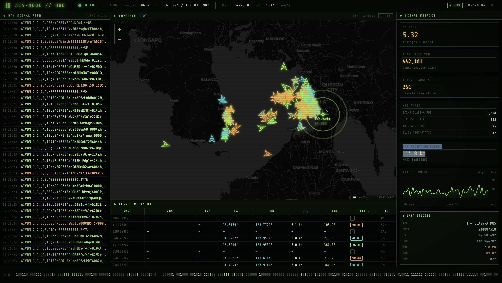
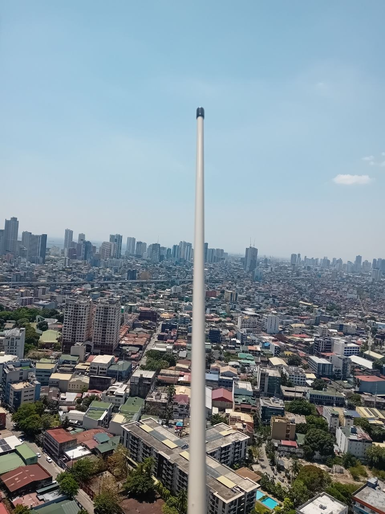
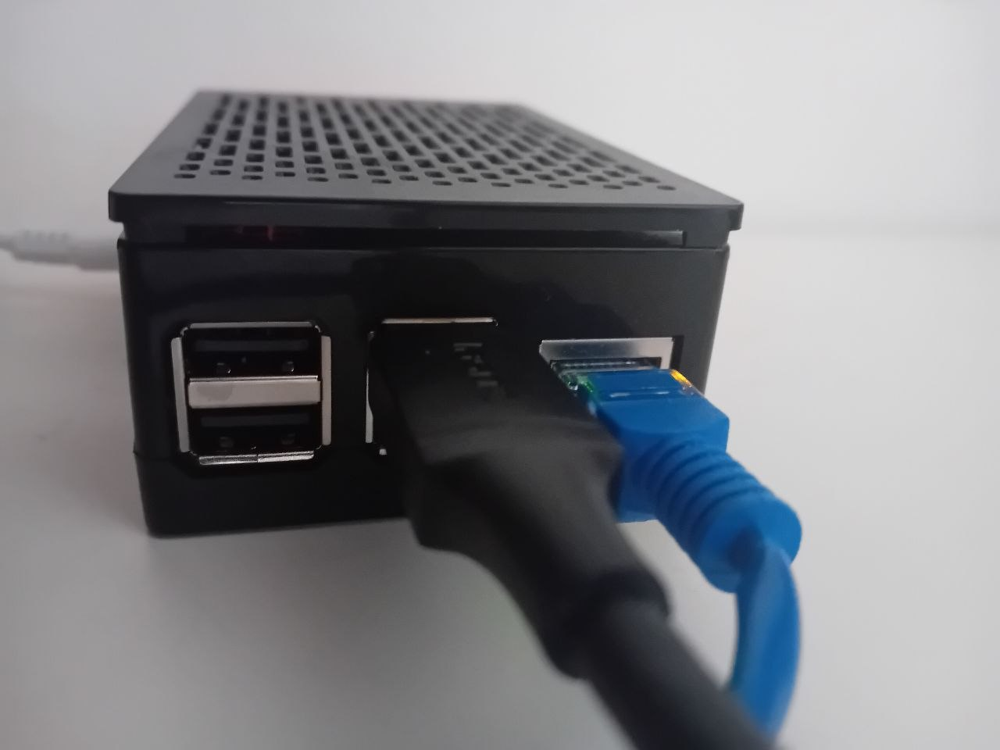

# ais-node

> A military-style HUD for live AIS vessel tracking, built on a $229 RTL-SDR setup and a Raspberry Pi.

[](https://github.com/framemodellc/ais-node/raw/main/assets/intro_video.mp4)

---

## Why I built this

I'm building [PortCongest](https://portcongest.com), a maritime intelligence platform for freight operators, commodity traders, and compliance teams. It needs a continuous feed of real-time vessel positions. Commercial AIS data subscriptions start at hundreds of dollars a month, so instead I set up a Raspberry Pi with an RTL-SDR dongle and an AIS antenna, contributed the local feed to [AISHub](https://www.aishub.net/), and get global vessel coverage in return. Operating cost: near zero.

This repo contains two things. The **Raspberry Pi receiver daemon** is what I actually run. It decodes AIS signals and forwards them to AISHub. The **HUD** is a bonus for anyone who sets this up and wants to see their own data visualized immediately, without needing to build a frontend from scratch.

---

## What it looks like


- Live vessel positions on a dark-themed Leaflet map
- Directional arrowhead markers showing course-over-ground
- Pulsing radar ring around your antenna location
- Rolling 60-second message-rate chart
- Decoded NMEA binary stream at the bottom
- Max reception range tracker
- Unique vessel counter

---

## Live stats from my deployment (Manila Bay, Philippines, April 2026)

| Metric | Value |
|--------|-------|
| Ships currently in coverage | **180** |
| Unique ships tracked | **172** |
| Weekly uptime | **100%** |
| Weekly avg vessels in coverage | **145** |
| Max reception range | ~74 km |
| Peak message rate | ~7 msg/s |
| Antenna elevation | **143m above sea level** |
| Theoretical radio horizon | ~57 km (line-of-sight formula) |
| Coverage area | ~17,000 km² |

Live station data: **[AISHub Station #3919, Manila, Philippines](https://www.aishub.net/stations/3919)**

> At 143m ASL, the radio horizon extends to roughly 49 km for the antenna alone. When you add the vessel's own antenna height (5-10m), the combined line-of-sight reaches 55-60 km geometrically, and up to ~74 km with normal atmospheric refraction over open water (a standard 15-20% extension beyond geometric line-of-sight). AIS frequency: **161.975 MHz / 162.025 MHz** (VHF channels 87B and 88B).

---

## Hardware (~$229 total)

| Part | PHP | USD (approx) |
|------|-----|-------------|
| Raspberry Pi 4B (2GB) | ₱4,640 | ~$81 |
| RTL-SDR Blog V3 (R860, TCXO, SMA) | ₱3,502 | ~$61 |
| Retevis MA06 VHF Marine Antenna (3.5 dBi, 43.3") | ₱3,147 | ~$55 |
| Official Pi 4 Power Supply (5V/3A USB-C) | ₱857 | ~$15 |
| Pi Case, USB extension, LAN cable, duct tape | ₱395 | ~$7 |
| 32GB microSD | — | ~$9 |
| **Total** | **~₱12,541** | **~$229** |

See [HARDWARE.md](HARDWARE.md) for the full bill of materials with exact prices, Shopee/Lazada links, and the parts I bought by mistake.

 

---

## Quick Start

### 1. Set up the Raspberry Pi

```bash
# On your Pi -- clone this repo and run the installer
git clone https://github.com/yourusername/ais-node.git
cd ais-node/raspberry-pi
sudo bash setup.sh
```

This installs `rtl-sdr`, builds [AIS-catcher](https://github.com/jvde-github/AIS-catcher), and registers a systemd service that starts automatically on boot. See [raspberry-pi/README.md](raspberry-pi/README.md) for full details and troubleshooting.

### 2. Configure the HUD

```bash
# On your laptop/server
cd ais-node/hud
cp .env.example .env
# Edit .env -- fill in your Pi's IP address and SSH credentials
```

### 3. Start the HUD

```bash
npm install
npm start
# Open http://localhost:3000
```

That's it. Vessels start appearing within seconds of the first AIS sentence being decoded.

---

## How it works

```
RTL-SDR dongle (162 MHz VHF)
        |
        v
  rtl_ais / AIS-catcher          <- running on Raspberry Pi
        |  (NMEA sentences)
        v
  /var/log/ais-forwarder.log     <- systemd service writes here
        |
        v  (SSH tail -f)
  Node.js server (server.js)     <- runs on your laptop/server
        |  (WebSocket)
        v
  Browser HUD (hud/public/index.html)
        |
        +-- Leaflet map with vessel markers
        +-- Chart.js traffic chart
        +-- Decoded NMEA binary stream
```

The Node.js server SSH-tails the log file on the Pi in real time, parses the raw NMEA sentences itself (no external AIS library; pure bit-level decoding in ~100 lines), and pushes decoded vessel objects to the browser over WebSocket.

---

## AIS message types decoded

| Type | Description |
|------|-------------|
| 1, 2, 3 | Class A position report (commercial vessels) |
| 5 | Voyage data (vessel name, destination, draught) |
| 18 | Class B position report (recreational / small vessels) |
| 21 | Aid to Navigation (buoys, lighthouses) |
| 24 | Class B static data (vessel name, callsign) |

---

## Stack

- **Backend:** Node.js, Express, `ws` (WebSocket), `ssh2`
- **Frontend:** Vanilla JS, Leaflet.js (CartoDB Dark Matter tiles), Chart.js
- **Pi decoder:** `rtl_ais` (primary), AIS-catcher v0.66 (fallback)
- **No database.** Everything is in-memory and live.

---

## Configuration

All configuration is via `hud/.env` (copy from `hud/.env.example`):

```env
SSH_HOST=192.168.1.xxx    # Pi IP address
SSH_USER=ais              # SSH username
SSH_PASS=your_password    # SSH password
LOG_PATH=/var/log/ais-forwarder.log
PORT=3000
```

To use a hardcoded antenna position (instead of IP geolocation), set `ANTENNA_LAT` and `ANTENNA_LON` in `server.js`.

---

## Contributing

Not actively maintained, but feel free to fork it and take it wherever you want. If you build something on top of it, open a PR or send me a DM.

---

## Data sharing

This setup forwards decoded AIS data to [AISHub](https://www.aishub.net/) by default (`data.aishub.net:3919`). AISHub aggregates feeds from volunteers worldwide and provides free AIS data in return. If you're running this from a location with good maritime coverage, consider keeping the forwarding enabled. Your data helps other researchers and maritime safety applications.

My station ([#3919, Manila](https://www.aishub.net/stations/3919)) has maintained 100% weekly uptime and covers 170-180 vessels at any given time.

---

## License

MIT. See [LICENSE](LICENSE).

Built by [Daniel Hendricks](https://portcongest.com) as the data collection backbone for [portcongest.com](https://portcongest.com). Vibe coded with Claude Sonnet 4.6.
